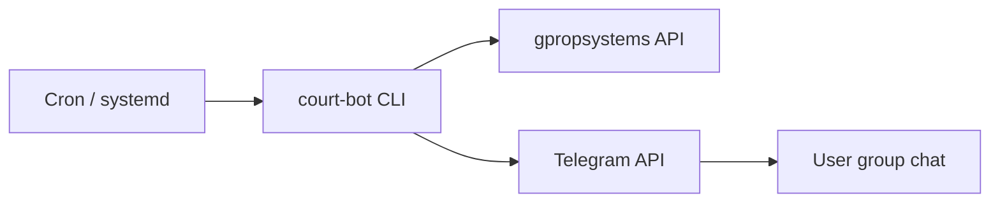
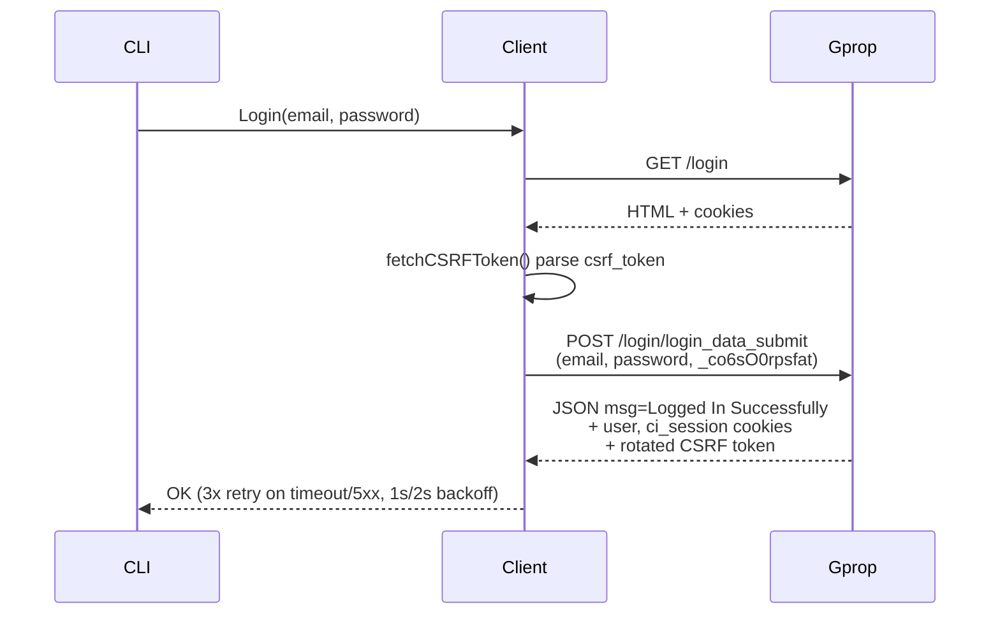
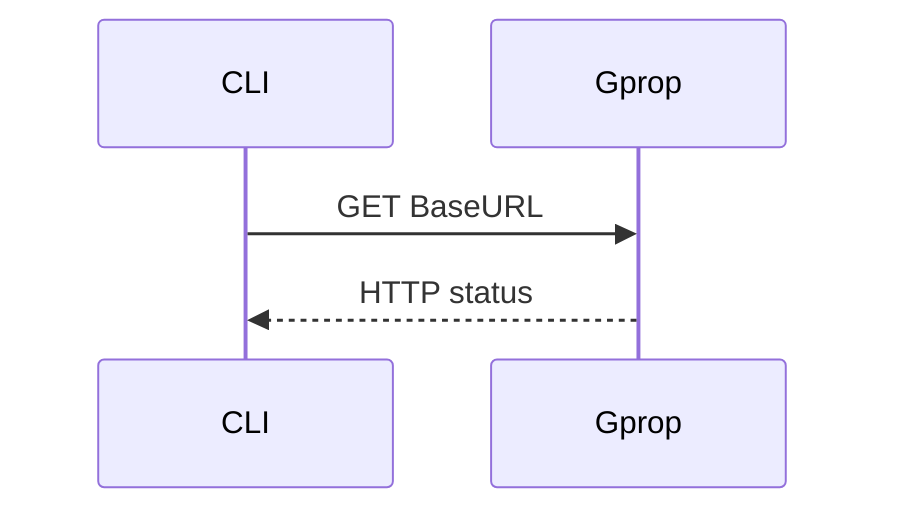
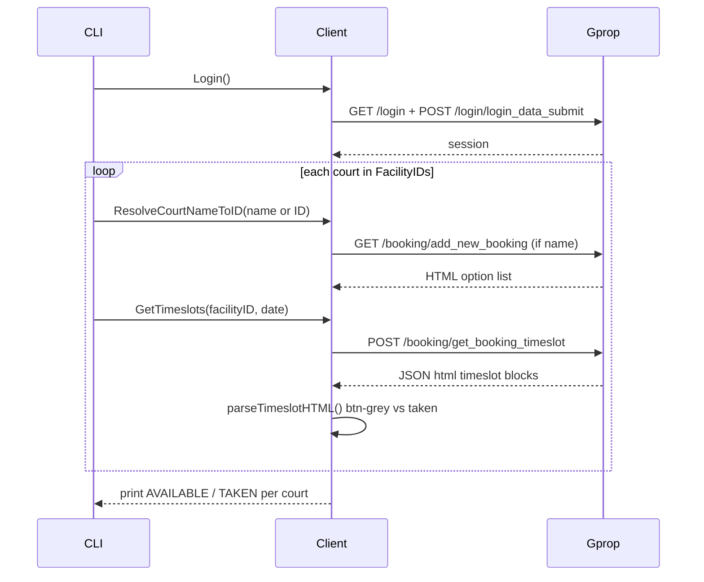
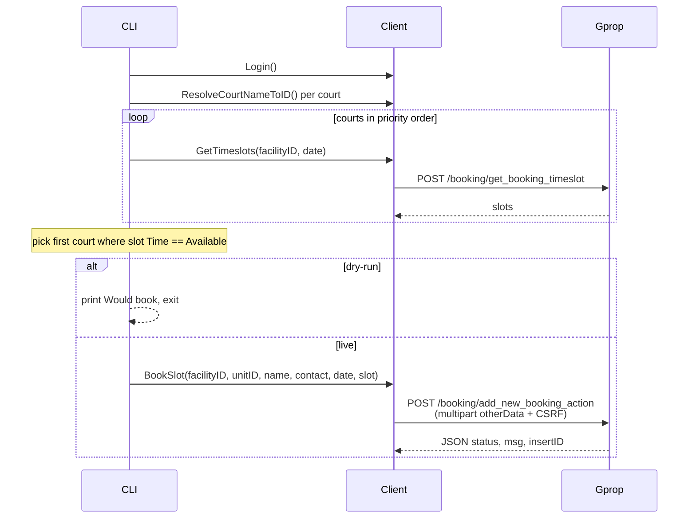
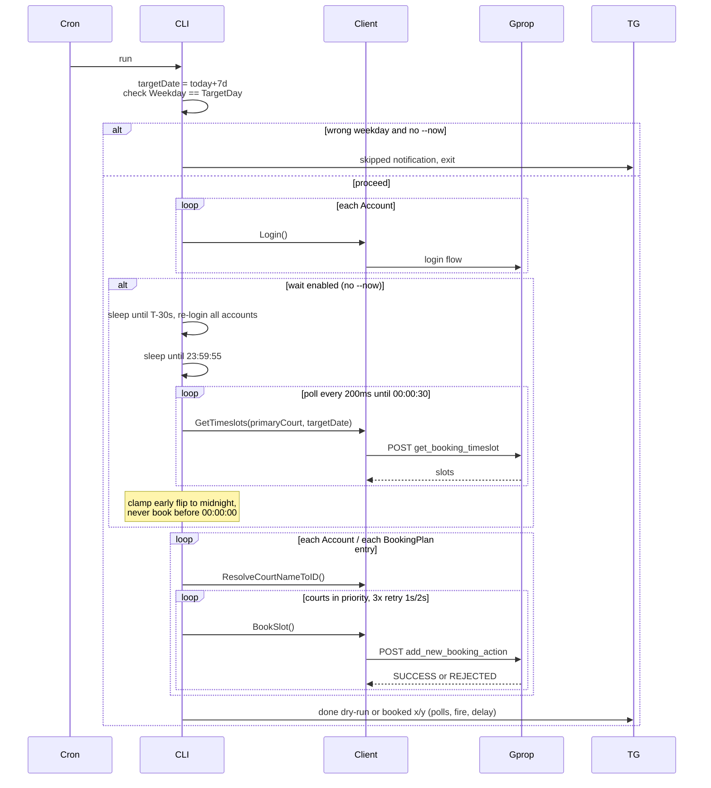
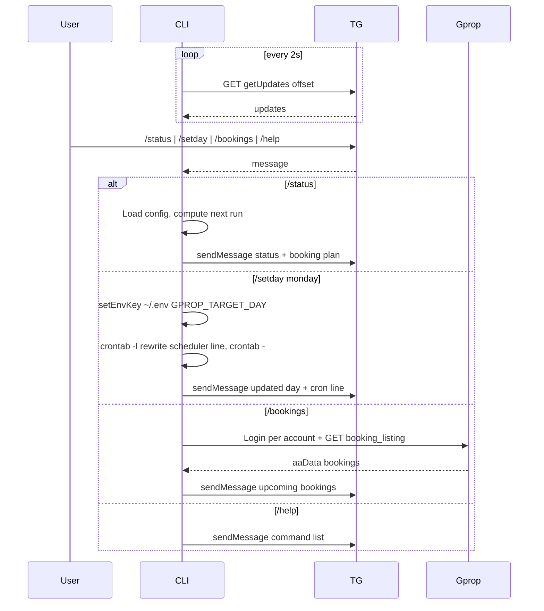
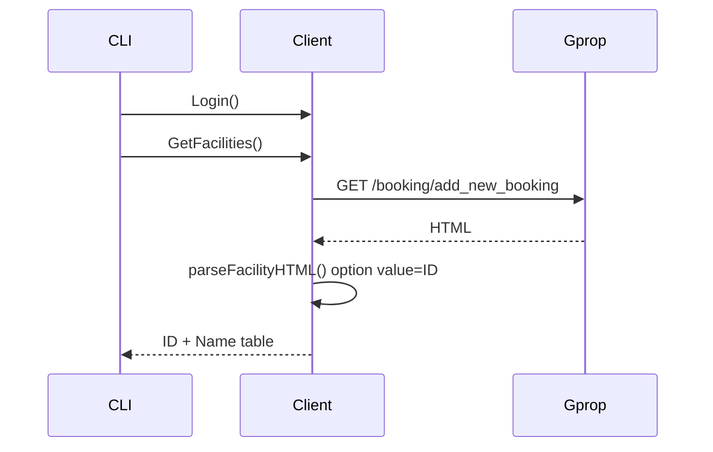
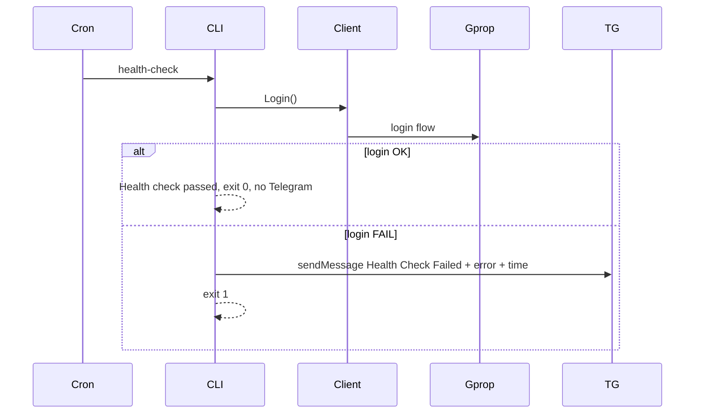

# Architecture & Flows

CLI bot for `gpropsystems.com`. See `README.md` for usage, `RUNBOOK.md` for ops.

Participants used below: `CLI` = `cmd/bot/main.go`, `Client` = `internal/api/client.go`, `Gprop` = gpropsystems, `TG` = Telegram Bot API, `Cron` = cron/systemd.

## 1. Login (shared sub-flow)

Used by `probe`, `book`, `run`, `facilities`, `health-check`, `/bookings`.

## 2. ping

## 3. probe

## 4. book

## 5. run (midnight snipe)

Cron: `0 0 * * 5 ./court-bot run --now`. Target date = today+7d. `--now` skips wait.

## 6. bot daemon (Telegram)

Polls `getUpdates` every 2s. Filters by `ChatID`. Commands: `/status`, `/setday`, `/bookings`, `/help`.

## 7. facilities

## 8. health-check

Cron daily `0 8 * * *`. Alerts only on failure.

